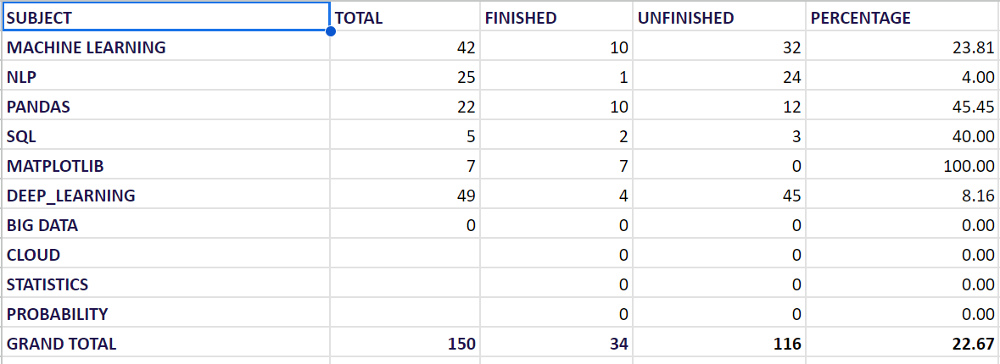

Dynamic progress tracking website using google sheet as backend, using google app script

design google sheet like this, you can add or modify any row or headings or any thing.but , you to keep no.of columns constant as in this image.last row must specified for grand totals.

Deploy app script:

1)then click extensions tab from top of google sheet -> app script \n
2)on code.gs page , paste code as in the "google_app_script.gs" page in this repository.
3)click on deploy on top right corner
4)if you didnt deployed anything , then click on new deployment , other wise manage deployment
5)if new deployment :
    5.1) select type as web app
    5.2) who as access -> anyone
    5.3) copy that deployment id and paste in "google_app_script.gs" in mentioned line
    5.4) click deploy to complete deployment
  if manage deployment :
    5.1) click on pencil button to edit details
    5.2) change version to new version
    5.3) copy that deployment id and paste in "google_app_script.gs" in mentioned line
    5.4) click deploy to complete deployment
6)ensure that you pasted deployment id in "google_app_script.gs" on mentioned part.
7)then , you are good to go
